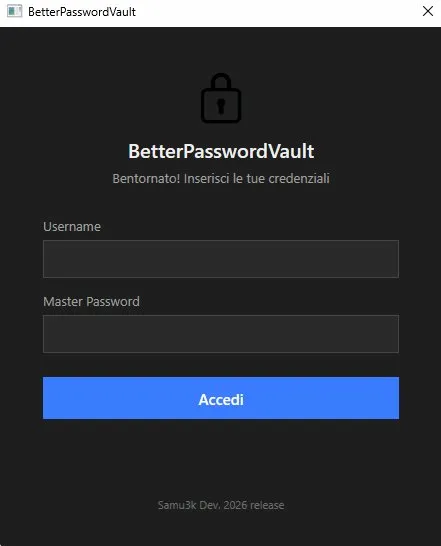
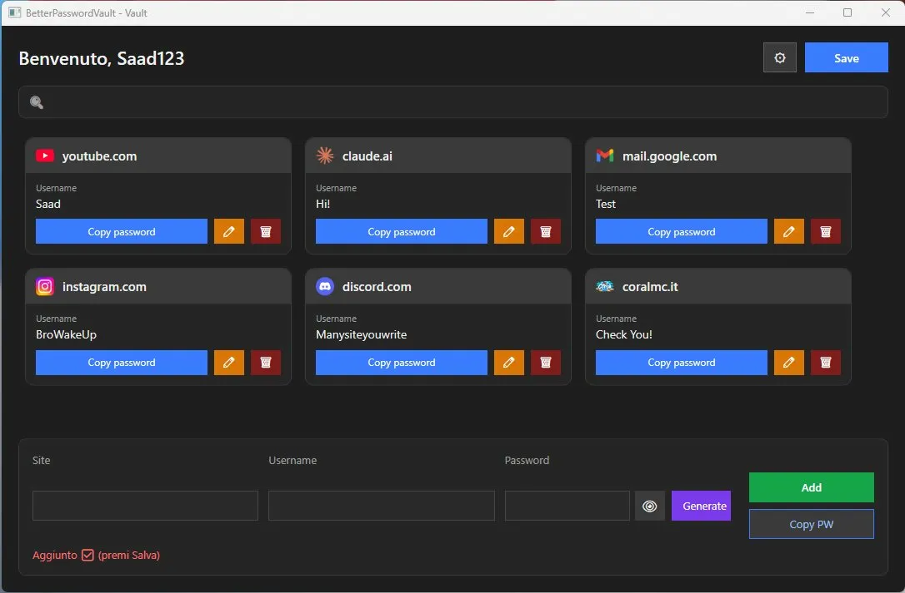
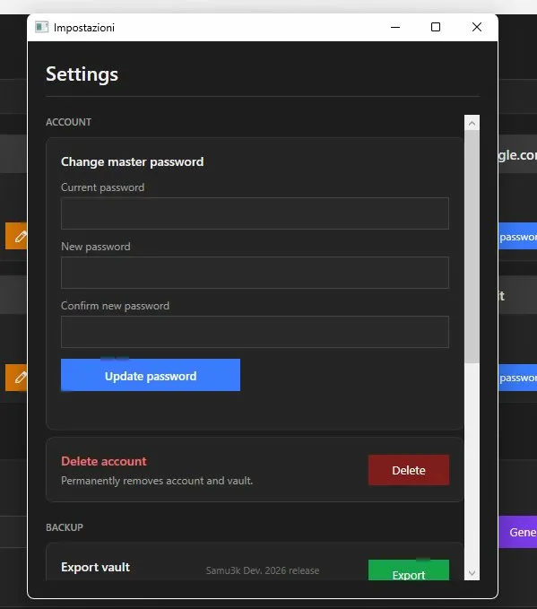

# 🔐 BetterPasswordVault

A secure, modern and personal password manager for Windows, built with C# and WPF.

---

## 📸 Screenshots

### Login

### Vault

### Settings

---

## ✨ Features

- 🔒 **AES-256 encryption** — your passwords are always encrypted on disk
- 🔑 **PBKDF2 SHA-256** authentication with 200,000 iterations
- 🌙 **Dark / Light theme** — switch anytime from the vault
- 🌍 **Italian / English** language support
- 🖼️ **Card-based UI** with automatic site favicon
- 🔍 **Search** by site name
- ✏️ **Add, Edit and Delete** credentials
- 📋 **Copy password** to clipboard with one click
- 🔐 **Auto-lock** after 10 minutes of inactivity
- 💾 **Encrypted vault export** (backup)
- 🔄 **Change master password** (re-encrypts the vault)
- ⚠️ **Unsaved changes warning** on exit

---

## 🚀 Getting Started

### Requirements
- Windows 10 or later
- .NET 8.0 or later

### Installation
1. Download the latest release (x86 or x64)
2. Run `BetterPasswordVault.exe`
3. Create your account with a strong master password
4. Start saving your credentials!

---

## 🔐 Security

- Passwords are encrypted with **AES-256-CBC**
- Master password is never stored — only a **PBKDF2 hash** is saved
- The vault key is derived separately from the auth hash
- Every save generates a **new random IV**

---

## 🗺️ Roadmap

### v1.0 ✅
- Auth + AES-256 encrypted vault
- Card UI with favicon
- Add / Edit / Delete credentials
- Search, themes, languages
- Auto-lock, backup export

### v1.1 🔜
- 2FA TOTP (Google Authenticator)
- Categories and filters

---

## 👨‍💻 Developer

**Samu3k** — 2026
